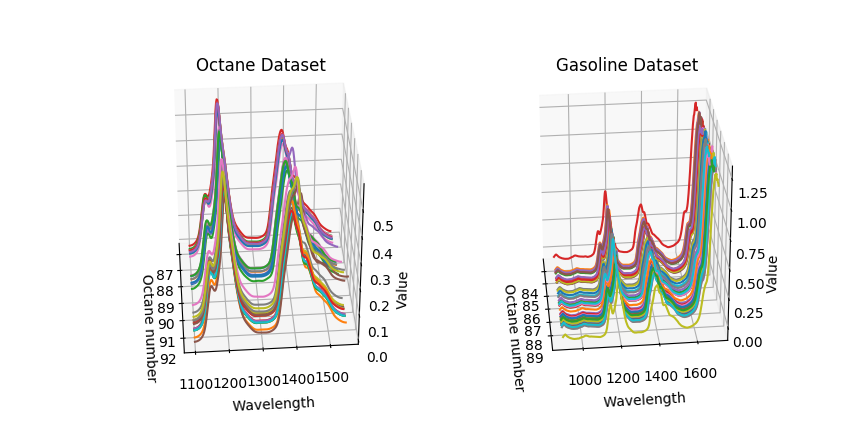
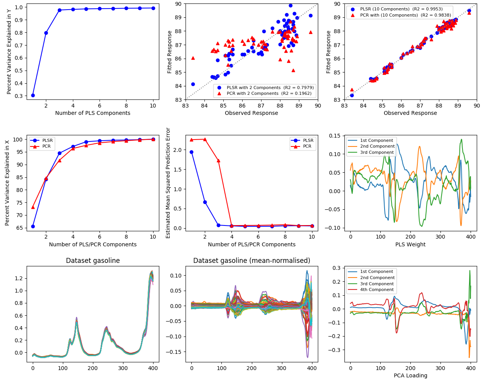

# Octane-NIR

Example of NIR spectrogram processing for regression using Python. Based on [this guide](https://www.mathworks.com/help/stats/examples/partial-least-squares-regression-and-principal-components-regression.html) from Mathworks.

- Used packages:
  - numpy
  - sklearn
  - pandas
  - matplotlib

## Datasets
- octane.xlsx - octane NIR dataset provided by CAMO Software. Available [here](https://www.impopen.com/software/octane-data-set)
- gasoline.csv - gasoline NIR dataset exported from [pls R package](https://www.rdocumentation.org/packages/pls/versions/2.7-0)

Preview:

# Resources:
- [A simple explanation of Partial Least Squares](http://users.cecs.anu.edu.au/~kee/pls.pdf)
- [Partial Least Squares. A tutorial](https://maths.ucd.ie/~brendan/chemometrics/PLS_TUTORIAL.pdf)
